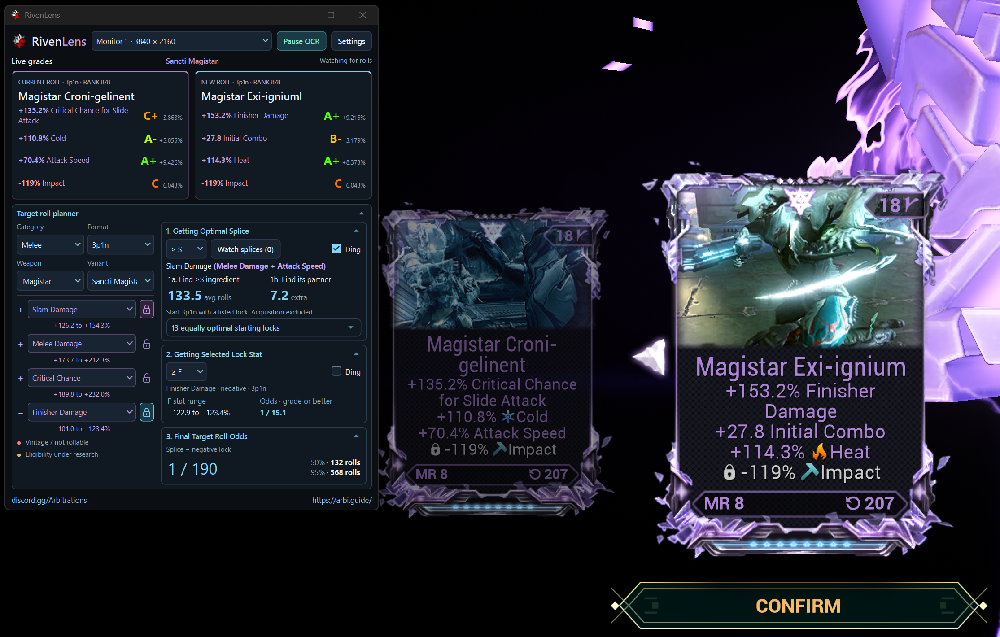

# RivenLens

A small desktop companion for grading Rivens as you roll.

## Why use RivenLens instead of AlecaFrame or WFHelper?

If you just want Riven grades without giving a tool access to the game or your
account, that's what RivenLens is built for.

[AlecaFrame](https://docs.alecaframe.com/get-started/connecting) gets inventory
data through Overwolf. [WFHelper](https://github.com/WFHelper/WFHelper#inventory-data)
offers several inventory sources; its recommended
[helper](https://github.com/Sainan/warframe-api-helper/blob/senpai/main.cpp)
reads session credentials from game memory to request inventory from Warframe's
servers. Although, WFHelper's Riven scanner does work without these integrations
or a connected account.

RivenLens uses **local Optical Character Recognition (OCR)** to read the text
already on your screen. It does not read game memory, obtain account tokens,
interact with the game or contact Warframe's servers. You make every in-game
choice. However, it's important to use your own judgement and use it at your own risk.

According to section 2.f of the Warframe EULA, you agree that you will not under any
circumstance use unauthorized third‑party tools designed to modify the game experience.
You should read the EULA and the code yourself and decide whether you want to use this tool.

Digital Extremes PSA about third‑party software:
https://forums.warframe.com/topic/1320042-third-party-software-and-you/

## Getting started

You'll need **64-bit Windows and Windows' OCR feature for your game's language**.
See [Language support](#language-support) below for supported languages and setup.

Download the [latest release](https://github.com/remesis/RivenLens/releases/latest)
and extract **RivenLens.zip** into a folder you can keep.
Double-click **Start Riven Lens.cmd**. If a standard 64-bit Python 3.13 or 3.14
install is missing, the launcher offers to download and install Python 3.13 for
you. Existing compatible installs are left alone. The first launch then installs
the required packages into RivenLens' own environment.

Choose your monitor and press **Start OCR**. Put RivenLens beside the cards or
on a second monitor. Capture always starts paused. **Pause OCR** stops scanning;
closing the window or choosing **Quit** exits the app.

## What's included

- Current and new rolls side by side, with automatic rank and variant detection.
- Collapsible splice, manual-lock and final-odds stages, shown when relevant.
- Separate good and warning dings, volume controls, ten presets each and custom audio.
- Remembered targets, sounds, collapsed sections and window placement.
- **Always on top** in Settings for an overlay-style window. Use windowed or
  borderless play; exclusive fullscreen may cover it.

## Language support

Select your game's language in the **bottom-center language picker**.
This changes OCR and the RivenLens interface together. The first
launch follows your Windows language when supported; your saved choice takes
priority afterward.

| Language | Warframe support | RivenLens support |
| --- | :---: | --- |
| English | ✅ | ✅ |
| French | ✅ | ✅ |
| Italian | ✅ | ✅ |
| German | ✅ | ✅ |
| Spanish - Spain | ✅ | ✅ |
| Portuguese - Brazil | ✅ | ✅ |
| Russian | ✅ | ✅ |
| Polish | ✅ | ✅ |
| Ukrainian | ✅ | ❌ No Windows OCR support at this time |
| Turkish | ✅ | ✅ |
| Japanese | ✅ | ✅ |
| Simplified Chinese | ✅ | ✅ |
| Traditional Chinese | ✅ | ✅ |
| Korean | ✅ | ✅ |
| Thai | ✅ | ❌ No Windows OCR support at this time |

If the matching Windows OCR feature is missing, RivenLens offers to download and
install it. This needs your approval, Windows administrator permission and an
internet connection; your display language and keyboard stay unchanged.
Support does not guarantee every roll will be read correctly.

## A few things to know

Keep the stat text, rank pips and bottom-right **Fits In** label visible. Small
text, animations and covered cards can confuse OCR. Previous grades stay visible
during brief interruptions. If capture is blank, try another capture method.

**Double-check important rolls before discarding them.** The warning covers
incomplete new-roll stat lines, not unreadable rank pips or variant labels.
Silence does not guarantee a correct read. Grades use bundled reference values;
planner odds are estimates, not guarantees.

Images and readings stay in memory and are not uploaded or automatically saved.
Settings, chosen sound copies and diagnostic logs are saved locally. Startup update
checks contact GitHub, never Warframe. Choose **Yes, update** to download, install
and reopen RivenLens automatically. Settings and custom sounds are preserved,
and the previous version is backed up. [Privacy details](docs/PRIVACY.md).

Updates come from [remesis/RivenLens](https://github.com/remesis/RivenLens/releases).
Only newer published releases prompt for an update. [Release configuration](docs/UPDATES.md).
Git checkouts are updated through Git instead of the automatic installer.
For copies from 0.1.0 or 0.1.1, download **RivenLens.zip** once and extract it into
a new folder to enable the updated installer. Your saved settings stay available.

## License

Copyright (C) 2026 remesis and RivenLens contributors.

RivenLens is free software under the **GNU General Public License version 3
only** ([GPL-3.0-only](LICENSE)). You may use, modify and redistribute
it under those terms. It comes **without warranty**. Distributed modified
versions must remain GPL-licensed and provide corresponding source code.
[Third-party notices and credits](docs/THIRD_PARTY_NOTICES.md).

[Discord](https://discord.gg/Arbitrations) · [arbi.guide](https://arbi.guide/)

Not affiliated with or endorsed by Digital Extremes.
